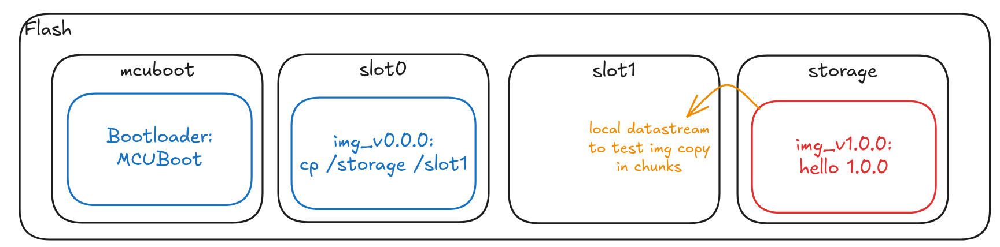
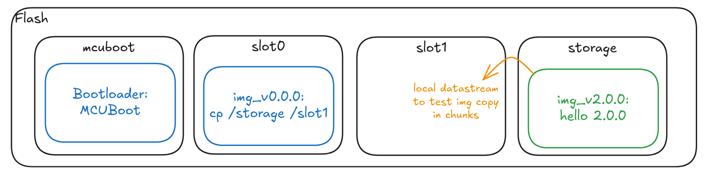

# Copy a firmware image from flash boot it using MCUboot

## Overview

This sample shows an example of firmware image copy from flash memory that is then booted by MCUBoot.
It supports different targets to anticipate issues arising from the variety of hardware in the embedded world (flash size, partitioning, log monitoring, swap strategies).

The targets supported for the samples are listed below along with pros and cons:


### Example: **Pros and Cons of Different MCUboot Configuration Methods**

| **Board** | **Brief** | **Pros** | **Cons** | **Status** |
| --------- | --------- | -------- | -------- | -------- |
| **ESP32C3-DevKitM**   | Espressif ESP32, single RISCV32 core  | + RISCV toolchain support (Rust) <br> + porting support (MCUboot, Zephyr, FreeRTOS) <br> + good amount of flash | - MCUboot porting don't support DIRECT XIP | Build: OK <br> Test: Fail unsigned image rejection, espressif mcuboot is unsigned (couldn't find how to force signed)
| **ESP32S3-DevKitM**   | Espressif ESP32, dual Xtensa core  | + porting support (MCUboot, Zephyr, FreeRTOS) <br> + good amount of flash | - no direct Rust support for Xtensa architecture <br> - MCUboot porting don't support DIRECT XIP | Build: No, issue Rust toolchain support <br> Test: No
| **Raspberry Pico2W**   | Dual-core ARM Cortex M33 or custom dual-core RISCV | + ARM toolchain support <br> + good amount of flash | - flashing tools compatibility with west <br> - Zephyr porting has some issues with flashing driver <br> - flashing partition handling requires extra setup | Build: No issue with padding and signing keys <br> Test: No, flashing at offset issue
| **micro::bit v2**   | Nordic nRF52833, ARM Cortex M4 | + ARM toolchain support <br> + support DIRECT XIP <br> + can monitor MCUboot while flashing <br> | - small flash | Build: OK <br> Test: OK but log disabled (arch specific issue)

The partitioning required for this sample is:
* **boot_partition**:  "mcuboot" for the bootloader
* **slot0_partition**: "image-0" for the primary firmware
* **slot1_partition**: "image-1" for the new firmware to test
* **storage_partition**: "storage" for the new "binary" to copy in slo1

## Project structure

The project uses sysbuild to generate the following 4 images:
* **mcuboot**: the MCUBoot bootloader (ported coded depending on target)
* **mcuboot_flash_img_copy (img_v0_0_0)**: access flash and copy storage partition in slot1
* **img_v1_0_0**: badly signed image that prints the image version
* **img_v2_0_0**: correctly signed image that prints the image version

## Gettings started

* Build the binaries

```bash
make <board>
```

* Flash binaries
```bash
cd updatebox/samples/zephyrs/mcuboot_flash_img_copy/
# Flash mcuboot independtly
python flash.py <board> --mcuboot
# Flash update tests
python flash.py <board> --good-update
python flash.py <board> --bad-update
# Flash in one command
python flash.py <board> --mcuboot --good-update
```

## Boot sequence

:warning: _For the development phase only, MCUboot default signature files will be used. In a deployment phase MCUboot has to be built using your own signature keys._

### Flashing an image unsigned


1. Target specific fsbl loads MCUBoot bootloader
2. MCUBoot loads image `mcuboot_flash_img_copy` (`img_v0_0_0`) from slot0
3. `img_v0_0_0` copies the `img_v1_0_0` into slot1, then reboots
4. MCUBoot fails loading `img_v1_0_0` because it is not signed, reboot on `img_v0_0_0`

### Flashing an image correctly signed


1. Target specific fsbl loads MCUBoot bootloader
2. MCUBoot loads image `mcuboot_flash_img_copy` (`img_v0_0_0`) from slot0
3. `img_v0_0_0` copies the `img_v2_0_0` into slot1, then reboots
4. MCUBoot succesfully loads `img_v2_0_0` and prints the hello message
